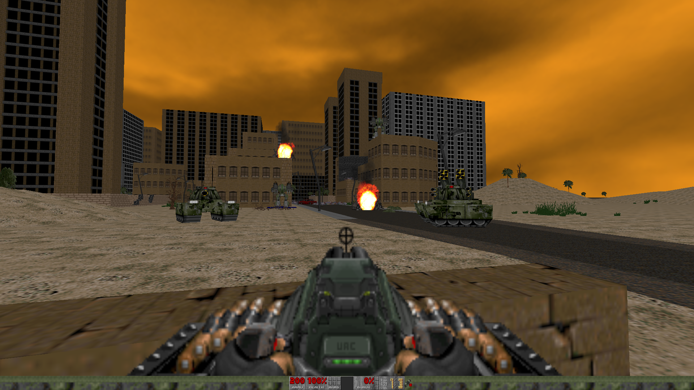

# Brutal DOOM Installer
**Set of scripts for installing/uninstalling**
> This software is under development!



## Targets
### [*] Main target
- **Making it easier to setup Brutal DOOM**

## How to deal with?
> There is only Arch Linux support for now!

### Setup:
1. Clone the repository:
```shell
git clone (repo url here)
cd BDInstaller
```
2. Install dialog package:
```shell
sudo pacman -Sy dialog
```

### Usage:
- To _install_ just type and answer the questions:
```shell
sudo ./setup.sh
```
- To _uninstall_ just type and answer the questions:
```shell
sudo ./uninstall.sh
```

## Platforms
- **Arch Linux**

## TODO
- **Add Debian- and RHEl- based distros support (just edit dependences.sh)**
- **Add ability to run Brutal DOOM with Free DOOM wad**
- **Rewrite using YAD**
